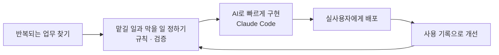

# 신해원 · Shin Haewon

**반복되는 일을 도구로 바꾸고, 그 안의 AI가 검증된 범위에서만 일하게 만듭니다**

## How I Work

## Projects

| 프로젝트 | 무엇 | 핵심 판단 | 링크 |
|---|---|---|---|
| **수업 리플레이** | 라이브 코딩 수업을 자동 기록하고 하루를 타임라인으로 복기하는 VS Code 확장 | 매일 손으로 하던 복기를 기록 자동화로 대체 |   |
| **기술블로그 읽기 가이드** | 기업 기술블로그를 수집해 사용자 수준에 맞는 읽기 가이드를 AI로 생성 (6인 팀) | 수집은 크롤링, 해석은 AI로 나눠 각각 검증 |   |
| **목표 역산 플래너** | 목표 금액에서 거꾸로 월별 실행 계획을 만드는 금융 플래너 | 숫자는 엔진이, 판단은 AI가. 검증 장치를 AI 앞(맥락)과 뒤(출력)에 |  |
| **ERP연구회 AIM 허브** | 경영학부 AI 스터디 운영 사이트 | 신청 · 공지 · 과제의 반복을 사이트로 흡수 |  |
| **ADsP 스터디 보드** | 자격증 스터디 진도 · 기출 관리 웹앱 (기출 877문항) | 1기 스터디원 실사용, 응시 10명 중 5명 합격 | 코드 비공개 |
| **Portfolio** | 결과보다 의사결정 과정을 타임라인으로 보여 주는 포트폴리오 | 무엇을 정하고 무엇을 버렸는지 기록 |   |

## AI Workflow

Claude Code를 규칙 아래에서 운영합니다 (설정 코드 비공개)

- 위험한 명령은 실행 전에 차단하고, 완료 주장은 별도 검증 에이전트가 다시 확인
- 규칙 준수율을 모델별로 측정해 설정을 조정
- 세 기기의 설정과 작업 기억을 하나로 동기화

## Tech Stack

## Certifications

-0FAAFF?style=flat-square&logo=sap&logoColor=white)
-0FAAFF?style=flat-square&logo=sap&logoColor=white)

## Recent Posts

<!-- BLOG-POST-LIST:START -->
<!-- BLOG-POST-LIST:END -->

<picture>
  <source media="(prefers-color-scheme: dark)" srcset="https://raw.githubusercontent.com/bapzzi/bapzzi/output/github-snake-dark.svg" />
  
</picture>
